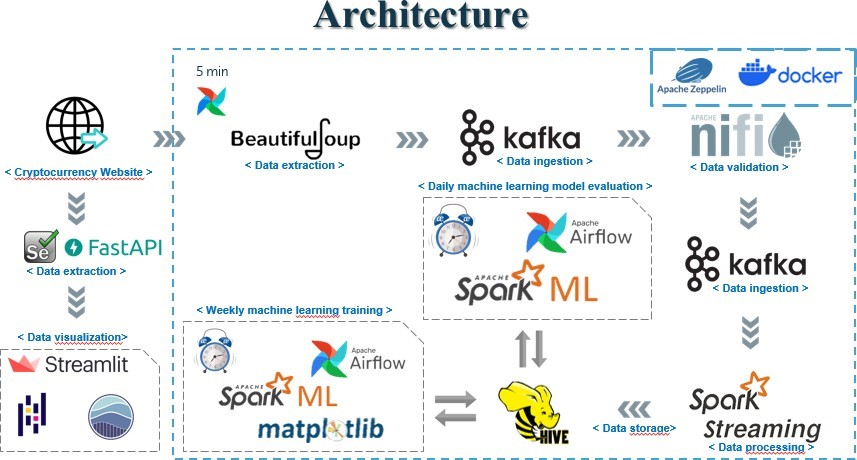

# Cryptocurrency Real-time Prediction System

## Overview

This project focuses on the dynamic processing and real-time prediction of data extracted from major cryptocurrency websites. Leveraging technologies such as Apache Kafka, Spark Streaming, Hive, Streamlit, and Apache Airflow, the system is designed to continuously process data, perform periodic self-training of machine learning models, and conduct daily self-evaluation to enhance prediction accuracy.

## Table of Contents

- [Objective](#objective)
- [Prerequisites](#prerequisites)
- [Environment Setup](#environment-setup)
- [System Architecture](#system-architecture)
- [Data Processing](#data-processing)
- [Machine Learning Models](#machine-learning-models)
- [Scheduling with Apache Airflow](#scheduling-with-apache-airflow)
- [Visualization with Streamlit](#visualization-with-streamlit)

## Objective

The primary goal of this project is to establish a robust and scalable system capable of:

- Real-time processing of cryptocurrency data.
- Periodic self-training of multiple machine learning models.
- Daily self-evaluation to identify the most accurate prediction model.

## Prerequisites

Before getting started, ensure your environment meets the following requirements:

- Operating System: Compatible with Docker and necessary tools.
- RAM: Minimum of 13 GB.
- Docker: Installed and verified.
- Docker Compose: Installed and verified.
- Link to Streamlit application : [Visual Stream app](https://mega.nz/file/sJclQYyB#AsxgK4J_XaSMIoNenaVh6JSfHH1BYdsZUAN9cQyL1jw)

## Environment Setup

Follow the [installation and configuration](#prerequisites) steps carefully to set up the development environment and Dockerized environment.

## System Architecture

The cryptocurrency real-time prediction system employs a distributed and scalable architecture to handle the complexities of processing, training, and evaluating machine learning models in real-time. The key components of the architecture include:

### 1. Data Ingestion and Processing

- **Apache Kafka:** Serves as the backbone for real-time data ingestion. Cryptocurrency data is streamed into Kafka topics, ensuring high-throughput and fault-tolerant data processing.

- **Spark Streaming:** Processes the streaming data in real-time, performing tasks such as data validation, feature extraction, and preparation for model training.

### 2. Machine Learning Model Training

- **Hive:** Stores pre-processed data in a distributed and query-optimized manner, enabling efficient retrieval during machine learning model training.

- **Machine Learning Models:** Multiple machine learning models are employed for predicting cryptocurrency trends. The models are periodically retrained using the latest data, ensuring adaptability to market changes.

### 3. Workflow Automation

- **Apache Airflow:** Orchestrates and automates the end-to-end workflow, from data processing to model training and evaluation. Airflow schedules tasks, monitors their execution, and handles dependencies between different stages.

### 4. Real-time Visualization

- **Streamlit:** Provides an interactive and user-friendly interface for visualizing real-time predictions. Users can explore cryptocurrency trends, model performance, and other relevant metrics through Streamlit dashboards.

The distributed nature of the architecture ensures scalability and resilience, making it suitable for handling large volumes of real-time cryptocurrency data. The integration of Apache Kafka, Spark Streaming, Hive, Apache Airflow, and Streamlit forms a comprehensive ecosystem for building a robust and efficient cryptocurrency prediction system.

## Data Processing

Explore the process of data extraction, ingestion, validation, table creation, and Spark Streaming for efficient data processing.

## Machine Learning Models

Discover the implementation of machine learning models, including setup, code, and model evaluation.

## Scheduling with Apache Airflow

Learn how to plan and automate workflows using Apache Airflow, ensuring seamless execution of tasks.

## Visualization with Streamlit

Understand how Streamlit is utilized for creating interactive and visually appealing data visualizations.

---

Feel free to contribute, report issues, or provide feedback. This project is open to collaboration, and your input is highly valued.

**Happy Coding!**
